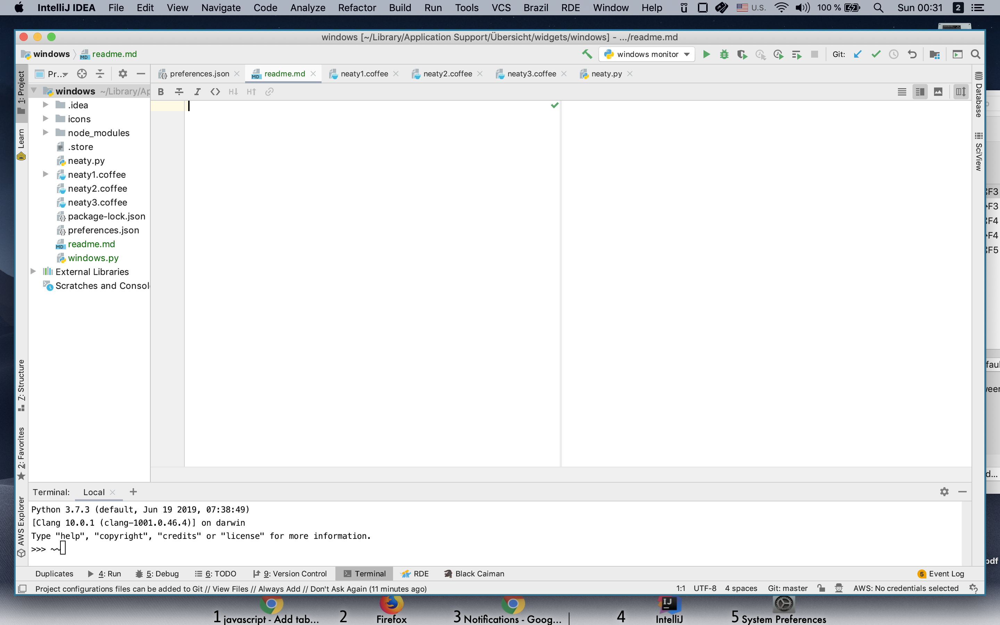
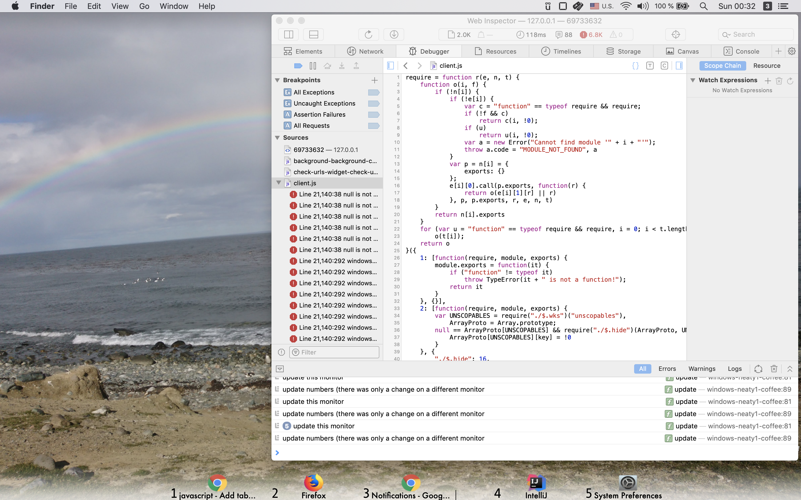

Neaty - Übersicht Widget for Neat Window Management
===================================================

You really like having a window tiling manager and think that 
[ChunkWM](https://koekeishiya.github.io/chunkwm/) on Mac is great? 

But you are not quite yet efficient enough using only your keyboard.
You are working with several monitors and each of them has potentially 
several desktops with windows open. 
In order to move from a window to the next, you have to:
1. Select the correct monitor. 
2. Switching through the desktops on that monitor to find the right one
3. Navigating with North/South/West/East to your desired window. 

It would be much neater to right away jump to the desired window. 
Here Neaty can help: 

1. enumerates all windows across all applications
2. given this window number you can access said window 
3. shows a bar with all the current windows on this monitor




Requirements
------------
* [ChunkWM](https://koekeishiya.github.io/chunkwm/)
* The ChunkWM [Scripting Addon](https://koekeishiya.github.io/chunkwm/docs/sa.html) enabled
* a Hotkey Manager, e.g. [SKHD](https://github.com/koekeishiya/skhd)
* [Übersicht](http://tracesof.net/uebersicht/) installed
* Python 3.6 or Python 3.7 with `pip3` installed

Installation
-------------
#### Get Widget ####
Copy this folder into your Übersicht widget folder. 
Very likely it is in the following place: 

`cd ~/Library/Application Support/Übersicht/widgets`

and clone this repository: 

`git clone https://github.com/fleicher/neaty && cd neaty`

install Python dependencies: 

`pip install -r requirements.txt`


#### Activate in Übersicht ####

Your Übersicht App should recognize this widget automatically. 
The sample repository contains three CoffeeScripts which are identical except 
that they each only show the windows for a specified monitor. 
When you click on the Übersicht icon on the top bar, chose that each widget
is only displayed on the corresponding monitor (="display"). 

When loading the first time, it will take a while as Neaty has 
to automatically retrieve the icons of all the processes currently open. 
But these are stored in the icons folder and can then directly be loaded. 

In the Übersicht "Preferences" you can also set an "Interaction Shortcut" 
to the modifier key of your liking. Now it is possible to click on an icon
from the bar and directly switch to that window. 

#### Set Hotkeys ####

For easy access you should now modify your keyboard shortcuts to use Neaty. 
If you are using SKHD, open the file `~/.skhdrc` and add the following lines:

```
alt - 1 : /usr/local/bin/python3 "/Users/<YOURUSER>/Library/Application Support/Übersicht/widgets/windows/neaty.py" --focus 1
alt - 2 : /usr/local/bin/python3 "/Users/<YOURUSER>/Library/Application Support/Übersicht/widgets/windows/neaty.py" --focus 2
alt - 3 : /usr/local/bin/python3 "/Users/<YOURUSER>/Library/Application Support/Übersicht/widgets/windows/neaty.py" --focus 3
alt - 4 : /usr/local/bin/python3 "/Users/<YOURUSER>/Library/Application Support/Übersicht/widgets/windows/neaty.py" --focus 4
alt - 5 : /usr/local/bin/python3 "/Users/<YOURUSER>/Library/Application Support/Übersicht/widgets/windows/neaty.py" --focus 5
alt - 6 : /usr/local/bin/python3 "/Users/<YOURUSER>/Library/Application Support/Übersicht/widgets/windows/neaty.py" --focus 6
alt - 7 : /usr/local/bin/python3 "/Users/<YOURUSER>/Library/Application Support/Übersicht/widgets/windows/neaty.py" --focus 7
alt - 8 : /usr/local/bin/python3 "/Users/<YOURUSER>/Library/Application Support/Übersicht/widgets/windows/neaty.py" --focus 8
alt - 9 : /usr/local/bin/python3 "/Users/<YOURUSER>/Library/Application Support/Übersicht/widgets/windows/neaty.py" --focus 9
alt - 0 : /usr/local/bin/python3 "/Users/<YOURUSER>/Library/Application Support/Übersicht/widgets/windows/neaty.py" --focus 10
```

Here replace `<YOURUSER>` with your user name (assuming this is your Übersicht folder).
Also make sure, that no user shortcut is using the combination "⌥ `Number`". 